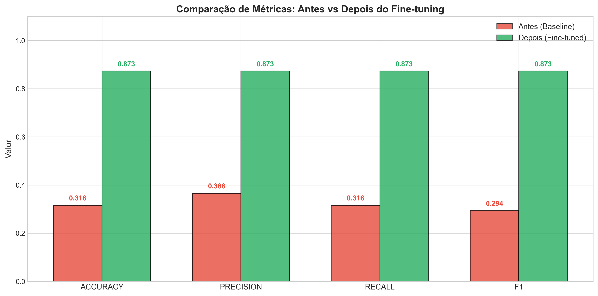
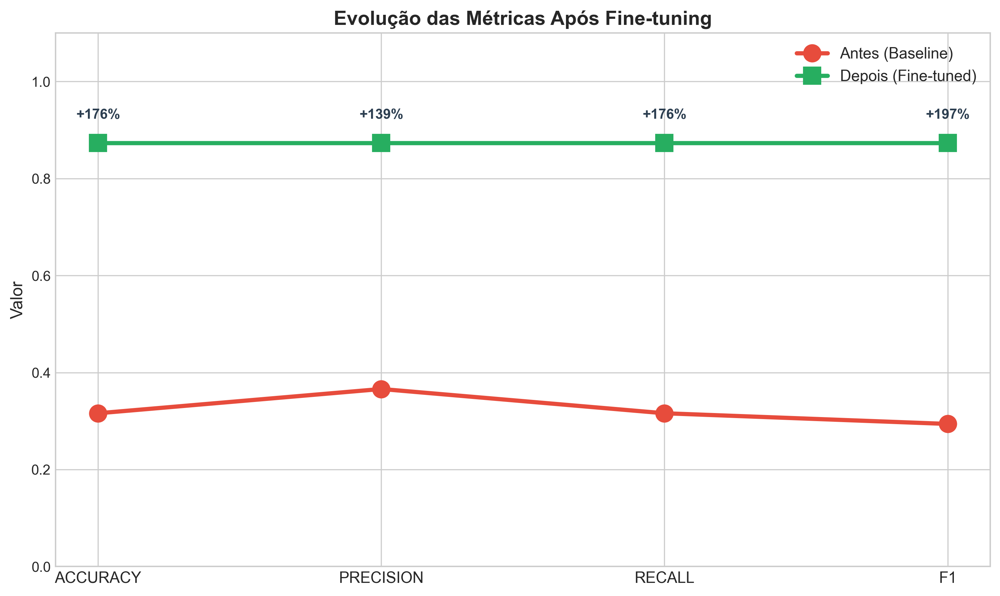
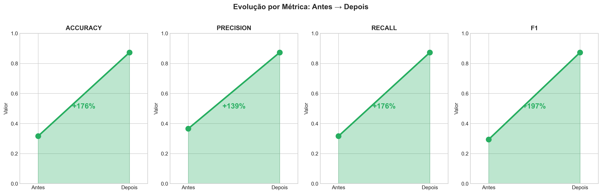
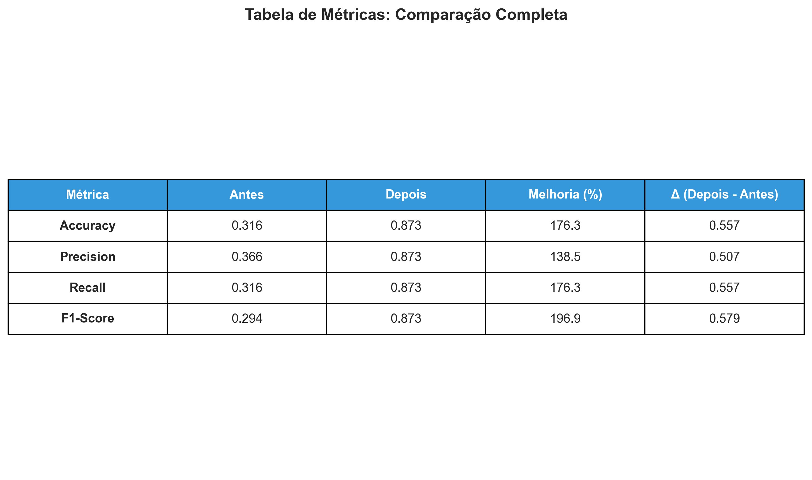
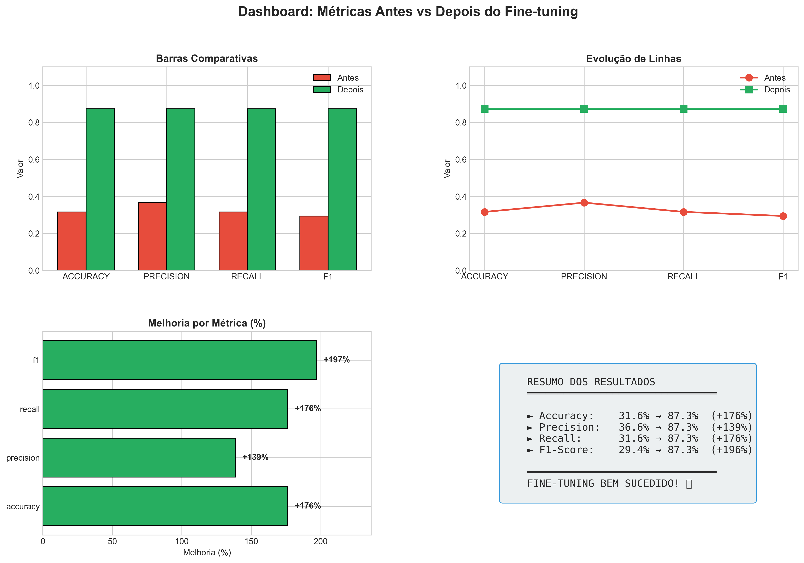

# BERT Financial Sentiment Classifier

Fine-tuning de BERT para classificação de sentimento em textos financeiros com 5 classes de saída.

## 📊 Resultados

| Métrica | Antes | Depois | Melhoria |
|---------|-------|--------|----------|
| **Accuracy** | 31.6% | 87.3% | +176% |
| **Precision** | 36.6% | 87.3% | +139% |
| **Recall** | 31.6% | 87.3% | +176% |
| **F1-Score** | 29.4% | 87.3% | +196% |

### 📈 Visualização das Métricas

#### 1. Gráfico de Barras Comparativas


#### 2. Evolução das Métricas (Linhas)


#### 3. Evolução por Métrica (Área Preenchida)


#### 4. Tabela de Métricas


#### 5. Dashboard Completo


## 🎯 Objetivo

Demonstrar o processo completo de **Transfer Learning** com BERT para classificação de sentimento no domínio financeiro, utilizando o modelo pré-treinado da Hugging Face.

## 🛠️ Tecnologias

- **Python** 3.10+
- **PyTorch** + **Transformers** (Hugging Face)
- **BERT Multilingual** (`nlptown/bert-base-multilingual-uncased-sentiment`)
- **Scikit-learn** para métricas de avaliação
- **Matplotlib** para visualização

## 📁 Estrutura do Projeto

```
├── TransformersBERT_Financial.ipynb  # Notebook principal com fine-tuning
├── export_metrics.py                  # Script para exportar gráficos de métricas
├── apresentacao_bert_financeiro.md    # Slides para apresentação (formato Markdown)
├── metricas_comparacao_barras.png      # Gráfico: barras comparativas
├── metricas_evolucao_linhas.png        # Gráfico: evolução com linhas
├── metricas_area_preenchida.png        # Gráfico: área preenchida por métrica
├── metricas_tabela_heatmap.png         # Gráfico: tabela com heatmap
├── metricas_dashboard_completo.png     # Dashboard completo
├── Fine-tuning-BERT-para-Classificacao-de-Sentimento-Financeiro.pdf  # Apresentação PPT
└── README.md                           # Este arquivo
```

## 📖 Pipeline Executado

1. **Carregamento do Dataset** - Financial Sentiment Dataset (Hugging Face)
2. **Filtragem de Classes** - De 9 para 5 classes principais
3. **Divisão dos Dados** - 85% treino / 10% validação / 5% teste
4. **Tokenização** - BERT Tokenizer (max_length=128)
5. **Fine-tuning** - 1 época, batch 16, learning rate 2e-5
6. **Avaliação** - Métricas antes e depois do treinamento
7. **Exportação** - Gráficos comparativos

## 📊 Apresentação do Projeto

O projeto possui uma apresentação em PowerPoint (PDF) com todos os detalhes:

📥 **[Baixar Apresentação PDF](./Fine-tuning-BERT-para-Classificacao-de-Sentimento-Financeiro.pdf)**

A apresentação inclui:
- Introdução e contextualização
- Dataset utilizado e distribuição de classes
- Arquitetura do modelo e configuração do fine-tuning
- Pipeline completo de processamento
- Análise do desequilíbrio de classes
- Resultados: métricas antes e depois do fine-tuning
- Gráficos comparativos de evolução
- Matriz de confusão
- Conclusões e limitações
- Sugestões de melhorias futuras
- Referências

## 📦 Dataset

- **Nome**: Financial Sentiment Dataset
- **Identificador**: `lwrf42/financial-sentiment-dataset`
- **Total de exemplos**: 90.135
- **Classes (5)**: negative, moderately negative, neutral, moderately positive, positive

## ⚙️ Configuração do Fine-tuning

| Parâmetro | Valor |
|-----------|-------|
| Modelo Base | nlptown/bert-base-multilingual-uncased-sentiment |
| Learning Rate | 2e-5 |
| Batch Size | 16 |
| Épocas | 1 |
| Max Length | 128 |

## 🚀 Como Executar

### 1. Clone o repositório
```bash
git clone https://github.com/seu-usuario/finbert-sentiment-classifier.git
cd finbert-sentiment-classifier
```

### 2. Execute o notebook
```bash
jupyter notebook TransformersBERT_Financial.ipynb
```

### 3. Ou execute o script de métricas
```bash
pip install matplotlib pandas numpy seaborn
python export_metrics.py
```

## ⚠️ Limitaciones

- **Desequilíbrio de classes**: O pipeline não implementa técnicas de balanceamento (class weights, oversampling). O dataset é desbalanceado (positive: 38%, moderately negative: 3%).
- **Tempo de treinamento**: Apenas 1 época para fins acadêmicos (para demonstrar o conceito).

## 💡 Possíveis Melhorias

- Implementar class weights para tratar o desequilíbrio de classes
- Aumentar o número de épocas (5-10) para melhor convergência
- Usar data augmentation para classes minoritárias
- Experimentar com outros modelos (RoBERTa, DeBERTa)
- Implementar early stopping para evitar overfitting

## 📚 Referências

- [BERT: Pre-training of Deep Bidirectional Transformers for Language Understanding](https://arxiv.org/abs/1810.04805)
- [Hugging Face Transformers](https://huggingface.co/transformers)
- [Financial Sentiment Dataset](https://huggingface.co/datasets/lwrf42/financial-sentiment-dataset)

---

**Desenvolvido como parte de projeto acadêmico - UFC**
*Deep Learning na Prática - Transformers*