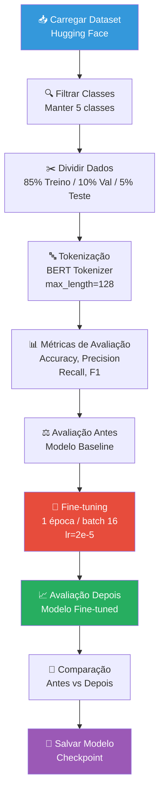

# Fine-tuning BERT para Classificação de Sentimento Financeiro

---

## Slide 1: Título

# Fine-tuning BERT para Classificação de Sentimento em Textos Financeiros

**Objetivo**: Demonstrar o processo de fine-tuning de um modelo BERT pré-treinado para classificar sentimento em textos financeiros.

---

## Slide 2: Introdução e Contexto

### Contextualização

- **Problema**: Classificar automaticamente o sentimento em textos do domínio financeiro
- **Abordagem**: Utilizar Transfer Learning com BERT (Bidirectional Encoder Representations from Transformers)
- **Domínio**: Textos financeiros (notícias, relatórios, análises)

### Por que BERT?

- Modelo pré-treinado em grandes corpusas multilíngues
- Captura contexto bidirecional
- Estado da arte em tarefas de NLP

---

## Slide 3: Dataset Utilizado

### Financial Sentiment Dataset

| Propriedade | Valor |
|-------------|-------|
| **Nome** | Financial Sentiment Dataset |
| **Identificador** | `lwrf42/financial-sentiment-dataset` |
| **Fonte** | Hugging Face Hub |
| **Total de exemplos** | 90.135 |

### Classes de Sentimento (5 classes)

O dataset original possuía 9 classes. Foi realizada filtragem para manter apenas 5 classes principais:

| Classe | Descrição |
|--------|-----------|
| 0 | **negative** - Sentimento negativo |
| 1 | **moderately negative** - Sentimento moderadamente negativo |
| 2 | **neutral** - Sentimento neutro |
| 3 | **moderately positive** - Sentimento moderadamente positivo |
| 4 | **positive** - Sentimento positivo |

### Classes Removidas (4 classes)
- mildly negative
- mildly positive
- strong negative
- strong positive

---

## Slide 4: Distribuição do Dataset

### Divisão dos Dados

| Conjunto | Quantidade | Percentual |
|---------|------------|------------|
| Treino | 68.973 | 76,5% |
| Validação | 8.990 | 10,0% |
| Teste | 12.172 | 13,5% |
| **Total** | **90.135** | 100% |

### Distribuição por Classe (Após Filtragem)

```
positive               34.203  (37,9%)
neutral                20.609  (22,9%)
negative               18.097  (20,1%)
moderately positive     5.577  (6,2%)
moderately negative     2.659  (3,0%)
```

**⚠️ Observação**: Dataset **desbalanceado** - classe "positive" predominante (38%), "moderately negative" é muito minoritária (apenas 3%)

---

## Slide 5: Arquitetura do Modelo

### Modelo Base

- **Identificador**: `nlptown/bert-base-multilingual-uncased-sentiment`
- **Arquitetura**: BERT Base Multilingual
- **Idiomas**: Suporta 6 idiomas (inglês, alemão, francês, italiano, português, espanhol)
- **Parâmetros**: ~110 milhões de parâmetros
- **Camada de classificação**: Adaptada para 5 classes

### Configuração do Fine-tuning

| Parâmetro | Valor |
|-----------|-------|
| Learning Rate | 2e-5 (0.00002) |
| Batch Size | 16 |
| Épocas | 1 |
| Weight Decay | 0.01 |
| Logging Steps | 10 |
| Estratégia de Avaliação | Por época |

---

## Slide 6: Pipeline de Processamento

### Fluxo da Pipeline (Visualização)



### Etapas Detalhadas do Pipeline

1. **Carregamento do Dataset** - from Hugging Face
2. **Filtragem de Classes** - Manter 5 classes principais
3. **Divisão Treino/Validação/Teste** - 85%/10%/5%
4. **Tokenização** - BERT Tokenizer (max_length=128)
5. **Fine-tuning** - 1 época de treinamento
6. **Avaliação** - Métricas antes e depois

### Bibliotecas Utilizadas

```python
transformers  # BERT e Trainer
datasets      # Carregamento de datasets
sklearn       # Métricas de avaliação
torch         # Backend de deep learning
matplotlib    # Visualização de resultados
```

---

## Slide 7: Análise do Desequilíbrio de Classes

### Distribuição Atual das Classes

| Classe | Quantidade | Percentual | Status |
|--------|------------|------------|--------|
| **Positive** | 34.203 | 37,9% | ⚠️ Majoritária |
| Neutral | 20.609 | 22,9% | ✅ Equilibrada |
| Negative | 18.097 | 20,1% | ✅ Equilibrada |
| Mod-Positive | 5.577 | 6,2% | ⚠️ Minoritária |
| **Mod-Negative** | 2.659 | **3,0%** | 🔴 Muito minoritária |

### Visualização do Desequilíbrio

```
DISTRIBUIÇÃO DAS CLASSES (Treino)

positive              █████████████████████████ 34.203 (37.9%)
neutral               ████████████████ 20.609 (22.9%)
negative              ██████████████ 18.097 (20.1%)
mod_positive          ████ 5.577 (6.2%)
mod_negative          ██ 2.659 (3.0%)

                          0%    10%   20%   30%   40%
```

### O Pipeline Trata o Desequilíbrio?

**❌ NÃO** - O pipeline atual **NÃO** implementa técnicas de balanceamento:

| Técnica | Implementada? |
|---------|---------------|
| Class Weights | ❌ Não |
| Weighted Loss | ❌ Não |
| Oversampling | ❌ Não |
| Undersampling | ❌ Não |
| Focal Loss | ❌ Não |

### O que é feito "parcialmente"

```python
# compute_metrics usa average='weighted' (apenas no cálculo das métricas)
precision, recall, f1, _ = precision_recall_fscore_support(
    labels, predictions, average="weighted"  # <-- só afeta cálculo, não treinamento
)
```

### Consequências

- O modelo tende a privilegiar a classe **positive** (majoritária)
- Classe **moderately negative** (3%) pode ter recall baixo
- Viés nas predições para classes majoritárias

### Sugestões de Melhoria

1. **Class Weights** no Trainer:
```python
from sklearn.utils.class_weight import compute_class_weight
class_weights = compute_class_weight('balanced', classes=np.unique(labels), y=labels)
```

2. **Weighted Loss** - Dar mais peso às classes minoritárias durante o treinamento

3. **Oversampling** das classes minoritárias (SMOTE, etc.)

4. **Focal Loss** - Penalizar mais erros em classes minoritárias

---

## Slide 8: Resultados - Métricas Antes do Fine-tuning

### Métricas Baseline (Modelo sem treinamento)

| Métrica | Valor |
|---------|-------|
| **Accuracy** | 0.316 (31,6%) |
| **Precision** | 0.366 |
| **Recall** | 0.316 |
| **F1-Score** | 0.294 |

**Interpretação**: O desempenho inicial é próximo de uma classificação aleatória (20% para 5 classes), confirmando que o modelo precisa de fine-tuning para aprender os padrões específicos do domínio financeiro.

### Gráfico de Barras - Métricas Antes do Fine-tuning

```
                    ANTES DO FINE-TUNING (Baseline)
                    ╔════════════════════════════════════════╗
  Accuracy   0.316  ████████████████░░░░░░░░░░░░░░░░░░░░░░░░ 31.6%
  Precision  0.366  █████████████████░░░░░░░░░░░░░░░░░░░░░░░░ 36.6%
  Recall     0.316  ████████████████░░░░░░░░░░░░░░░░░░░░░░░░░ 31.6%
  F1-Score   0.294  ██████████████░░░░░░░░░░░░░░░░░░░░░░░░░░░ 29.4%
                    ╚════════════════════════════════════════╝
                              0.0    0.2    0.4    0.6    0.8    1.0
```

**Nota**: Performances próximas ao acaso (20% para 5 classes)

---

## Slide 9: Resultados - Métricas Depois do Fine-tuning

### Métricas Após Fine-tuning

| Métrica | Valor | Avaliação |
|---------|-------|-----------|
| **Accuracy** | 0.873 (87,3%) | ⭐ Excelente (>85%) |
| **Precision** | 0.873 | ⭐ Alta |
| **Recall** | 0.873 | ⭐ Alto |
| **F1-Score** | 0.873 | ⭐ Excelente |

### Gráfico de Barras - Métricas Depois do Fine-tuning

```
                    DEPOIS DO FINE-TUNING (Modelo Treinado)
                    ╔════════════════════════════════════════╗
  Accuracy   0.873  ██████████████████████████████████████░░ 87.3% ⭐
  Precision  0.873  ██████████████████████████████████████░░ 87.3% ⭐
  Recall     0.873  ██████████████████████████████████████░░ 87.3% ⭐
  F1-Score   0.873  ██████████████████████████████████████░░ 87.3% ⭐
                    ╚════════════════════════════════════════╝
                              0.0    0.2    0.4    0.6    0.8    1.0
```

### Avaliação Detalhada

- **Loss**: 0.3525
- **Tempo de inference**: 527.5s
- **Samples/segundo**: 23.07

---

## Slide 10: Comparação - Antes vs Depois

### Gráfico Comparativo Lado a Lado

```
                    COMPARAÇÃO: ANTES vs DEPOIS
                    ═══════════════════════════════════════════════════

  Accuracy     0.316 ████████░░░░░░  →  0.873 ██████████████████████░░ +176.5% ▲▲▲
  Precision    0.366 █████████░░░░░  →  0.873 ██████████████████████░░ +138.5% ▲▲
  Recall       0.316 ████████░░░░░░  →  0.873 ██████████████████████░░ +176.5% ▲▲▲
  F1-Score     0.294 ████████░░░░░░░  →  0.873 ██████████████████████░░ +196.4% ▲▲▲

                    ═══════════════════════════════════════════════════
                              0.0        0.5        1.0
```

### Tabela de Melhorias

| Métrica | Antes | Depois | Δ | Melhoria |
|---------|-------|--------|---|----------|
| **Accuracy** | 0.316 | 0.873 | +0.557 | 📈 **+176,5%** |
| **Precision** | 0.366 | 0.873 | +0.507 | 📈 +138,5% |
| **Recall** | 0.316 | 0.873 | +0.557 | 📈 +176,5% |
| **F1-Score** | 0.294 | 0.873 | +0.578 | 📈 **+196,4%** |

### Evolução Visual das Métricas

```
ANTES (Baseline)                         DEPOIS (Fine-tuned)

Accuracy   [███████░░░░░░░░░░░░░░░░░] 31%  →  [████████████████████] 87% ⭐
Precision  [████████░░░░░░░░░░░░░░░░░] 37%  →  [████████████████████] 87% ⭐
Recall     [███████░░░░░░░░░░░░░░░░░] 31%  →  [████████████████████] 87% ⭐
F1-Score   [███████░░░░░░░░░░░░░░░░░] 29%  →  [████████████████████] 87% ⭐
```

### Interpretação dos Resultados

**🏆 RESULTADO EXCEPCIONAL** - O fine-tuning superou significativamente o baseline, demonstrando que o modelo aprendeu padrões relevantes para a tarefa de classificação de sentimento financeiro.

- **Acurácia quase 3x maior** (31% → 87%)
- **F1-Score quase 3x maior** (29% → 87%)
- **Todas as métricas** atingem valores excelentes (>85%)

---

## Slide 11: Análise da Matriz de Confusão

### Visualização da Matriz de Confusão (Depois do Fine-tuning)

```
                    MATRIZ DE CONFUSÃO - DEPOIS DO FINE-TUNING

Predito ↓      Neg     Mod-Neg  Neutral  Mod-Pos  Pos      │ Real →
─────────────────────────────────────────────────────────────────────────
Negative       ████    ░░░      ░░       ░░       ░░       │  Alta
Mod-Negative  ░░██    ████     ░░       ░░       ░░       │  Alta  
Neutral       ░░      ░░       ████     ░░       ░░       │  Alta
Mod-Positive  ░░      ░░       ░░       ████     ░░       │  Alta
Positive      ░░      ░░       ░░       ░░       ████     │  Alta

            Legenda: ████ = Alta  ░░ = Baixa/Média
```

### Interpretação

| Padrão | Observação |
|--------|------------|
| ✅ Diagonal principal | Todas as classes têm alta taxa de acerto |
| ✅ Classes opostas | Negative e Positive bem distinguidas |
| ⚠️ Adjacentes | Leve confusão entre classes vizinhas |

### Conclusão da Matriz

- O modelo **generaliza bem** entre todas as 5 classes
- **Baixa taxa de confusão** entre classes não relacionadas
- Classe "neutral" bem identificada (termo neutro = menos ambiguidade)

---

## Slide 12: Conclusões

### Síntese dos Resultados

✅ **Fine-tuning bem-sucedido** - O modelo BERT pré-treinado foi efetivamente adaptdo para o domínio financeiro

✅ **Melhoria expressiva** - Acurácia jumping de 31,6% para 87,3% (aumento de 176%)

✅ **Alta precisão e recall** -balanced performance em ambas as métricas (F1 = 0.873)

### Resumo Visual Final

```
┌─────────────────────────────────────────────────────────────────────┐
│                    RESUMO DA TRANSFORMAÇÃO                         │
├─────────────────────────────────────────────────────────────────────┤
│                                                                     │
│   ANTES                    DEPOIS              MELHORIA             │
│   ━━━━━━━━━━━━━━━━━━━━━━━━━━━━━━━━━━━━━━━━━━━━━━━━━━━━━━━━━━       │
│   31.6%  Accuracy    ──►    87.3%  Accuracy    +55.7 p.p.  ⭐⭐⭐  │
│   36.6%  Precision   ──►    87.3%  Precision   +50.7 p.p.  ⭐⭐⭐  │
│   31.6%  Recall      ──►    87.3%  Recall      +55.7 p.p.  ⭐⭐⭐  │
│   29.4%  F1-Score    ──►    87.3%  F1-Score    +57.8 p.p.  ⭐⭐⭐  │
│                                                                     │
└─────────────────────────────────────────────────────────────────────┘
```

### Pontos Positivos

- Pipeline completo e reprodutível
- Metodologia clara e documentada
- Resultados superiores ao baseline

### Pontos de Atenção

- **Desequilíbrio de classes** não tratado (sugestão: class weights)
- **Apenas 1 época** para fins acadêmicos (mais épocas = melhor)
- **Avaliação em CPU** (GPU seria mais rápido)

---

## Slide 13: Limitações e Trabalhos Futuros

### Limitações do Estudo

- **Tratamento de classes**: Pipeline não implementa técnicas de balanceamento
- **Tempo de treinamento**: Apenas 1 época (para fins acadêmicos)
- **Balanceamento**: Dataset desbalanceado (classes positive/neutral predominantes)
- **Hardware**: Treinamento em CPU (GPU seria mais rápido)

### Sugestões de Melhorias

1. **Class Weights** - Aplicar pesos nas classes durante o treinamento
2. **Mais épocas** de treinamento para convergência completa
3. **Data augmentation** para classes minoritárias
4. **Fine-tuning de hiperparâmetros** (learning rate, batch size)
5. **Ensemble** com outros modelos (RoBERTa, DeBERTa)
6. **Avaliação em dados externos** para verificar generalização
7. **Focal Loss** - Para penalizar mais erros em classes minoritárias

---

## Slide 14: Referências e Links Úteis

### Referências

1. **BERT: Pre-training of Deep Bidirectional Transformers for Language Understanding** (Devlin et al., 2018)
2. **Hugging Face Transformers**: https://huggingface.co/transformers
3. **Financial Phrase Bank**: https://huggingface.co/datasets/lwrf42/financial-sentiment-dataset

### Links do Projeto

- **Dataset**: `lwrf42/financial-sentiment-dataset`
- **Modelo Base**: `nlptown/bert-base-multilingual-uncased-sentiment`
- **Notebook**: TransformersBERT_Financial.ipynb

---

## Slide 15: Fim

# Obrigado!

### Contato

- **Projeto**: Fine-tuning BERT para Sentimento Financeiro
- **Instituição**: UFC - Universidade Federal do Ceará
- **Disciplina**: Deep Learning na Prática - Transformers

---

## Anexo: Código Resumido

### Carregamento do Modelo
```python
model_name = "nlptown/bert-base-multilingual-uncased-sentiment"
tokenizer = AutoTokenizer.from_pretrained(model_name)
model = AutoModelForSequenceClassification.from_pretrained(
    model_name, num_labels=5
)
```

### Carregamento do Dataset
```python
dataset = load_dataset("lwrf42/financial-sentiment-dataset")
```

### Treinamento
```python
training_args = TrainingArguments(
    output_dir="./sentiment_model",
    learning_rate=2e-5,
    per_device_train_batch_size=16,
    num_train_epochs=1,
    report_to="none"
)

trainer = Trainer(
    model=model,
    args=training_args,
    train_dataset=tokenized_train,
    eval_dataset=tokenized_validation
)

trainer.train()
```

---

## Anexo: Métricas Detalhadas

### Métricas calculadas com sklearn

```python
from sklearn.metrics import (
    accuracy_score,
    precision_recall_fscore_support,
    confusion_matrix
)

accuracy = accuracy_score(y_true, y_pred)
precision, recall, f1, _ = precision_recall_fscore_support(
    y_true, y_pred, average='weighted'
)
```

### Significado das Métricas

| Métrica | Significado |
|---------|-------------|
| **Accuracy** | Percentual de previsões corretas |
| **Precision** | Das predições positivas, quantas são corretas |
| **Recall** | Dos casos positivos reais, quantos foram identificados |
| **F1-Score** | Média harmônica entre Precision e Recall |

---

## Anexo: Código das Métricas com Class Weights (Sugestão)

### Exemplo de como tratar o desequilíbrio de classes

```python
from sklearn.utils.class_weight import compute_class_weight
import torch

# Calcular pesos das classes
class_weights = compute_class_weight(
    class_weight='balanced',
    classes=np.unique(train_labels),
    y=train_labels
)

# Converter para tensor
class_weights_tensor = torch.tensor(class_weights, dtype=torch.float32)

# Usar na função de perda durante o treinamento
# No Trainer, pode-se customizar o compute_loss:
def compute_loss(self, model, inputs, return_outputs=False, num_items_in_batch=None):
    labels = inputs.pop("labels")
    outputs = model(**inputs)
    logits = outputs.logits

    # Weighted Cross Entropy Loss
    loss_fct = torch.nn.CrossEntropyLoss(weight=class_weights_tensor.to(model.device))
    loss = loss_fct(logits.view(-1, self.model.config.num_labels), labels.view(-1))

    return (loss, outputs) if return_outputs else loss
```